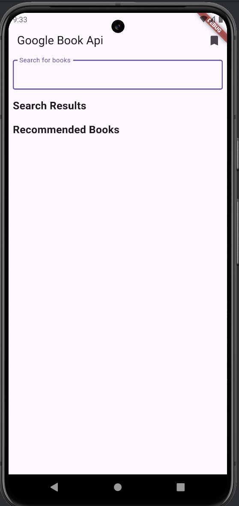
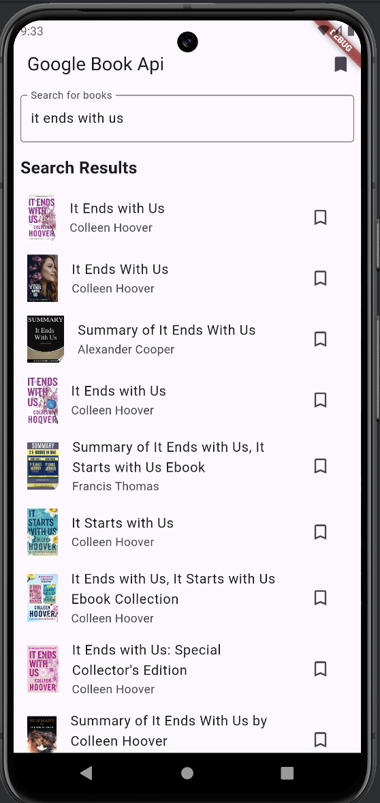
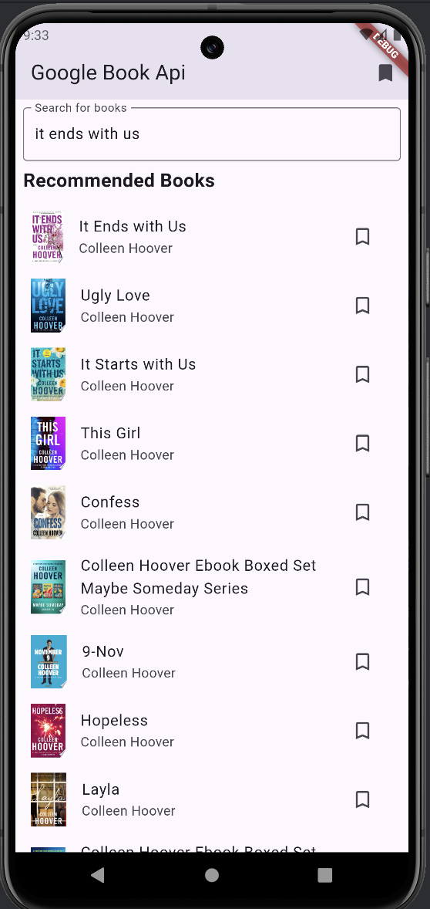

# Book Recommendation App

A Flutter application that allows users to search for books and get recommendations using the Google Books API. The app displays detailed information about the books and allows users to bookmark their favorite ones.

## Features

- Search for books using the Google Books API
- Display detailed information about books
- Get book recommendations based on the searched book
- Bookmark favorite books for easy access

## Screenshots

### Search Screen


### Book Details Screen


### Book Recommendations Screen


## Installation

To get started with this project, follow these steps:

1. **Clone the repository:**
    ```bash
    git clone https://github.com/Siz-An/GoogleBook_api_flutter.git
    cd GoogleBook_api_flutter
    ```

2. **Install dependencies:**
    ```bash
    flutter pub get
    ```

3. **Run the app:**
    ```bash
    flutter run
    ```

## Dependencies

- [Provider](https://pub.dev/packages/provider) for state management
- [http](https://pub.dev/packages/http) 
- [Google Books API](https://developers.google.com/books/docs/v1/getting_started) for book data

## Contributing

Contributions are welcome! Please open an issue or submit a pull request.


